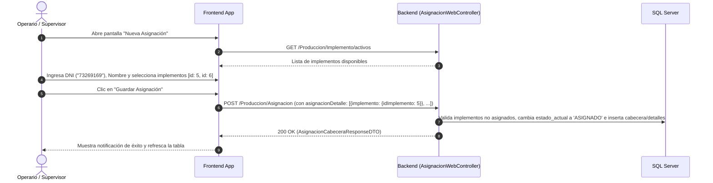
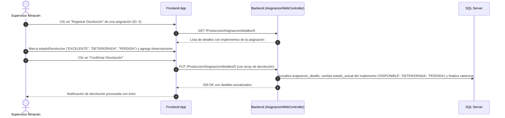
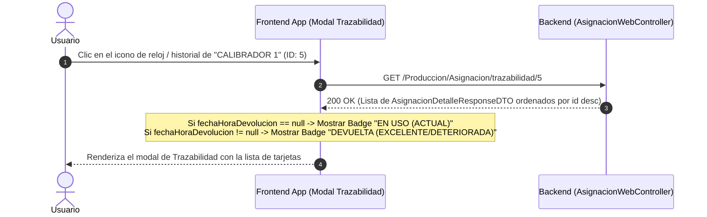

# Especificación Técnica de Consumo de APIs: Módulo de Producción (Implementos y Asignaciones)

**Versión:** 1.0.0  
**Audiencia:** Desarrolladores Frontend (React, Angular, Vue, Flutter, Mobile, etc.)  
**Base URL:** `http://localhost:8085/api` (o variable de entorno `VITE_API_BASE_URL` / `API_URL`)  
**Formato de Intercambio:** `application/json`

---

## 1. Convenciones Globales y Estándares

### 1.1. Cabeceras Obligatorias (Headers)
Todas las solicitudes HTTP deben incluir las siguientes cabeceras:
```http
Authorization: Bearer <JWT_ACCESS_TOKEN>
Content-Type: application/json
Accept: application/json
```

### 1.2. Estructura Estándar de Respuesta (`ApiResponseProvider<T>`)
Todos los endpoints que devuelven respuestas exitosas (a excepción de los paginados de Spring `Page<T>`) están encapsulados en la siguiente estructura genérica:

```typescript
interface ApiResponseProvider<T> {
  codigo: string;     // "200" para éxito, "400", "500", etc.
  mensaje: string;    // Mensaje descriptivo de la operación
  data: T | null;     // Carga útil de la respuesta (objeto, arreglo o null)
  cantidad: number | null;
  error: string | null;
}
```

### 1.3. Estructura Estándar de Paginación (`Page<T>`)
Para endpoints con `/listado-paginado`, Spring Boot retorna directamente:

```typescript
interface SpringPage<T> {
  content: T[];              // Arreglo de elementos de la página actual
  totalElements: number;     // Conteo total de registros en BD
  totalPages: number;        // Número total de páginas disponibles
  size: number;              // Cantidad de elementos por página solicitados
  number: number;            // Índice de página actual (0-indexed: 0 es la primera página)
  numberOfElements: number;  // Cantidad de elementos en la página actual
  first: boolean;            // ¿Es la primera página?
  last: boolean;             // ¿Es la última página?
  empty: boolean;            // ¿Está vacía la página?
}
```

---

# 2. Controladores y Endpoints

---

## 2.1. Tipo de Implemento (`TipoImplementoWebController`)
**Base Path:** `/Produccion/TipoImplemento`

### 2.1.1. `POST /Produccion/TipoImplemento` - Guardar Tipo de Implemento
- **Descripción:** Crea un nuevo catálogo/tipo de implemento (ej: "TIJERA", "CALIBRADOR", "GUANTES").
- **Content-Type:** `application/json`

#### Request Body
| Campo | Tipo | Obligatorio | Descripción | Restricciones |
| :--- | :--- | :---: | :--- | :--- |
| `nombreTipoImplemento` | `string` | **Sí** | Nombre descriptivo del tipo de implemento | No en blanco |
| `codigoTipoImplemento` | `string` | **Sí** | Código corto o sigla identificadora | No en blanco (ej: `"TIJ"`, `"CAL"`) |

**Ejemplo de Request Body:**
```json
{
  "nombreTipoImplemento": "CALIBRADOR",
  "codigoTipoImplemento": "CAL"
}
```

#### Response (HTTP 200 OK)
```json
{
  "codigo": "200",
  "mensaje": "Tipo de implemento guardado con éxito.",
  "data": {
    "idTipoImplemento": 4,
    "nombreTipoImplemento": "CALIBRADOR",
    "codigoTipoImplemento": "CAL",
    "estado": "1",
    "fechaCreacion": "2026-09-09T08:38:13.058-05:00",
    "fechaModificacion": null
  },
  "cantidad": null,
  "error": null
}
```

---

### 2.1.2. `GET /Produccion/TipoImplemento/{id}` - Obtener por ID
- **Descripción:** Retorna la información de un tipo de implemento específico.

#### Parámetros Path
| Parámetro | Tipo | Obligatorio | Descripción |
| :--- | :--- | :---: | :--- |
| `id` | `number (Long)` | **Sí** | ID del TipoImplemento |

#### Response (HTTP 200 OK)
```json
{
  "codigo": "200",
  "mensaje": "Tipo de implemento obtenido con éxito.",
  "data": {
    "idTipoImplemento": 4,
    "nombreTipoImplemento": "CALIBRADOR",
    "codigoTipoImplemento": "CAL",
    "estado": "1",
    "fechaCreacion": "2026-09-09T08:38:13.058-05:00",
    "fechaModificacion": null
  },
  "cantidad": null,
  "error": null
}
```

---

### 2.1.3. `PUT /Produccion/TipoImplemento/{id}` - Actualizar por ID
- **Descripción:** Actualiza el nombre o código de un tipo de implemento.

#### Parámetros Path
| Parámetro | Tipo | Obligatorio | Descripción |
| :--- | :--- | :---: | :--- |
| `id` | `number (Long)` | **Sí** | ID del TipoImplemento a actualizar |

#### Request Body
```json
{
  "nombreTipoImplemento": "CALIBRADOR DIGITAL",
  "codigoTipoImplemento": "CAL-DIG"
}
```

#### Response (HTTP 200 OK)
```json
{
  "codigo": "200",
  "mensaje": "Tipo de implemento actualizado con éxito.",
  "data": {
    "idTipoImplemento": 4,
    "nombreTipoImplemento": "CALIBRADOR DIGITAL",
    "codigoTipoImplemento": "CAL-DIG",
    "estado": "1",
    "fechaCreacion": "2026-09-09T08:38:13.058-05:00",
    "fechaModificacion": "2026-09-09T09:10:00.000-05:00"
  },
  "cantidad": null,
  "error": null
}
```

---

### 2.1.4. `GET /Produccion/TipoImplemento` - Listar Todos
- **Descripción:** Retorna la lista total de tipos de implementos (activos e inactivos).

#### Response (HTTP 200 OK)
```json
{
  "codigo": "200",
  "mensaje": "Listado de tipos de implementos obtenido con éxito.",
  "data": [
    {
      "idTipoImplemento": 1,
      "nombreTipoImplemento": "TIJERA",
      "codigoTipoImplemento": "TIJ",
      "estado": "1",
      "fechaCreacion": "2026-09-09T08:00:00.000-05:00",
      "fechaModificacion": null
    },
    {
      "idTipoImplemento": 4,
      "nombreTipoImplemento": "CALIBRADOR",
      "codigoTipoImplemento": "CAL",
      "estado": "1",
      "fechaCreacion": "2026-09-09T08:38:13.058-05:00",
      "fechaModificacion": null
    }
  ],
  "cantidad": 2,
  "error": null
}
```

---

### 2.1.5. `GET /Produccion/TipoImplemento/activos` - Listar Activos
- **Descripción:** Retorna únicamente los tipos de implementos con `estado = "1"`. Ideal para poblar selects/dropdowns en formularios.

#### Response (HTTP 200 OK)
```json
{
  "codigo": "200",
  "mensaje": "Listado de tipos de implementos activos obtenido con éxito.",
  "data": [
    {
      "idTipoImplemento": 1,
      "nombreTipoImplemento": "TIJERA",
      "codigoTipoImplemento": "TIJ",
      "estado": "1",
      "fechaCreacion": "2026-09-09T08:00:00.000-05:00",
      "fechaModificacion": null
    }
  ],
  "cantidad": 1,
  "error": null
}
```

---

### 2.1.6. `DELETE /Produccion/TipoImplemento/{id}` - Anular Tipo de Implemento
- **Descripción:** Realiza borrado lógico cambiando `estado = "0"`.

#### Parámetros Path
| Parámetro | Tipo | Obligatorio | Descripción |
| :--- | :--- | :---: | :--- |
| `id` | `number (Long)` | **Sí** | ID del TipoImplemento |

#### Response (HTTP 200 OK)
```json
{
  "codigo": "200",
  "mensaje": "Tipo de implemento anulado con éxito.",
  "data": null,
  "cantidad": null,
  "error": null
}
```

---

## 2.2. Implementos Físicos (`ImplementoWebController`)
**Base Path:** `/Produccion/Implemento`

### 2.2.1. `POST /Produccion/Implemento` - Creación Individual o Masiva con Correlativo
- **Descripción:** Crea **N** implementos físicos asociados a un `TipoImplemento`. El backend autogenera el nombre con correlativo consecutivo (ej. si ya existen 5 tijeras, al pedir `cantidad=3` creará `"TIJERA 6"`, `"TIJERA 7"`, `"TIJERA 8"`).
- **Query Parameters:**
  | Parámetro | Tipo | Requerido | Default | Descripción |
  | :--- | :--- | :---: | :---: | :--- |
  | `cantidad` | `number (Integer)` | No | `1` | Número de implementos correlativos a crear |

#### Request Body
| Campo | Tipo | Obligatorio | Descripción | Restricciones / Valores Permitidos |
| :--- | :--- | :---: | :--- | :--- |
| `tipoImplemento` | `object` | **Sí** | Objeto con el ID del tipo de implemento | No nulo |
| `tipoImplemento.idTipoImplemento` | `number (Long)` | **Sí** | ID del TipoImplemento padre | Existente en BD |
| `estadoActual` | `string` | No | Estado inicial del implemento | `"DISPONIBLE"`, `"ASIGNADO"`, `"DETERIORADA"`, `"PERDIDA"` (Default: `"DISPONIBLE"`) |
| `observacion` | `string` | No | Observaciones generales del lote | Texto libre |

**Ejemplo de Request Body (`POST /Produccion/Implemento?cantidad=3`):**
```json
{
  "tipoImplemento": {
    "idTipoImplemento": 4
  },
  "estadoActual": "DISPONIBLE",
  "observacion": "Lote nuevo recibido de almacén central"
}
```

#### Response (HTTP 200 OK)
```json
{
  "codigo": "200",
  "mensaje": "Implemento(s) guardado(s) con éxito.",
  "data": [
    {
      "idImplemento": 5,
      "nombreImplemento": "CALIBRADOR 1",
      "estadoActual": "DISPONIBLE",
      "observacion": "Lote nuevo recibido de almacén central",
      "tipoImplemento": {
        "idTipoImplemento": 4,
        "nombreTipoImplemento": "CALIBRADOR",
        "codigoTipoImplemento": "CAL",
        "estado": "1",
        "fechaCreacion": "2026-09-09T08:38:13.058-05:00",
        "fechaModificacion": null
      },
      "estado": "1",
      "fechaCreacion": "2026-09-09T08:38:47.510-05:00",
      "fechaModificacion": null
    },
    {
      "idImplemento": 6,
      "nombreImplemento": "CALIBRADOR 2",
      "estadoActual": "DISPONIBLE",
      "observacion": "Lote nuevo recibido de almacén central",
      "tipoImplemento": {
        "idTipoImplemento": 4,
        "nombreTipoImplemento": "CALIBRADOR",
        "codigoTipoImplemento": "CAL",
        "estado": "1",
        "fechaCreacion": "2026-09-09T08:38:13.058-05:00",
        "fechaModificacion": null
      },
      "estado": "1",
      "fechaCreacion": "2026-09-09T08:38:47.510-05:00",
      "fechaModificacion": null
    },
    {
      "idImplemento": 7,
      "nombreImplemento": "CALIBRADOR 3",
      "estadoActual": "DISPONIBLE",
      "observacion": "Lote nuevo recibido de almacén central",
      "tipoImplemento": {
        "idTipoImplemento": 4,
        "nombreTipoImplemento": "CALIBRADOR",
        "codigoTipoImplemento": "CAL",
        "estado": "1",
        "fechaCreacion": "2026-09-09T08:38:13.058-05:00",
        "fechaModificacion": null
      },
      "estado": "1",
      "fechaCreacion": "2026-09-09T08:38:47.510-05:00",
      "fechaModificacion": null
    }
  ],
  "cantidad": 3,
  "error": null
}
```

---

### 2.2.2. `GET /Produccion/Implemento/{id}` - Obtener Implemento por ID
- **Descripción:** Retorna los datos detallados de un implemento físico.

#### Response (HTTP 200 OK)
```json
{
  "codigo": "200",
  "mensaje": "Implemento obtenido con éxito.",
  "data": {
    "idImplemento": 5,
    "nombreImplemento": "CALIBRADOR 1",
    "estadoActual": "DISPONIBLE",
    "observacion": "En buen estado",
    "tipoImplemento": {
      "idTipoImplemento": 4,
      "nombreTipoImplemento": "CALIBRADOR",
      "codigoTipoImplemento": "CAL",
      "estado": "1",
      "fechaCreacion": "2026-09-09T08:38:13.058-05:00",
      "fechaModificacion": null
    },
    "estado": "1",
    "fechaCreacion": "2026-09-09T08:38:47.510-05:00",
    "fechaModificacion": null
  },
  "cantidad": null,
  "error": null
}
```

---

### 2.2.3. `PUT /Produccion/Implemento/{id}` - Actualizar Implemento
- **Descripción:** Permite modificar el nombre, observación o estado actual de un implemento físico.

#### Request Body
```json
{
  "nombreImplemento": "CALIBRADOR 1 (CALIBRADO)",
  "estadoActual": "DISPONIBLE",
  "observacion": "Revisión técnica realizada",
  "tipoImplemento": {
    "idTipoImplemento": 4
  }
}
```

#### Response (HTTP 200 OK)
```json
{
  "codigo": "200",
  "mensaje": "Implemento actualizado con éxito.",
  "data": {
    "idImplemento": 5,
    "nombreImplemento": "CALIBRADOR 1 (CALIBRADO)",
    "estadoActual": "DISPONIBLE",
    "observacion": "Revisión técnica realizada",
    "tipoImplemento": {
      "idTipoImplemento": 4,
      "nombreTipoImplemento": "CALIBRADOR",
      "codigoTipoImplemento": "CAL",
      "estado": "1",
      "fechaCreacion": "2026-09-09T08:38:13.058-05:00",
      "fechaModificacion": null
    },
    "estado": "1",
    "fechaCreacion": "2026-09-09T08:38:47.510-05:00",
    "fechaModificacion": "2026-09-09T09:40:00.000-05:00"
  },
  "cantidad": null,
  "error": null
}
```

---

### 2.2.4. `GET /Produccion/Implemento/activos` - Listar Implementos Activos
- **Descripción:** Retorna todos los implementos activos con su tipo de implemento anidado.

#### Response (HTTP 200 OK)
```json
{
  "codigo": "200",
  "mensaje": "Listado de implementos activos obtenido con éxito.",
  "data": [
    {
      "idImplemento": 5,
      "nombreImplemento": "CALIBRADOR 1",
      "estadoActual": "DISPONIBLE",
      "observacion": "",
      "tipoImplemento": {
        "idTipoImplemento": 4,
        "nombreTipoImplemento": "CALIBRADOR",
        "codigoTipoImplemento": "CAL",
        "estado": "1",
        "fechaCreacion": "2026-09-09T08:38:13.058-05:00",
        "fechaModificacion": null
      },
      "estado": "1",
      "fechaCreacion": "2026-09-09T08:38:47.510-05:00",
      "fechaModificacion": null
    }
  ],
  "cantidad": 1,
  "error": null
}
```

---

### 2.2.5. `DELETE /Produccion/Implemento/{id}` - Anular Implemento
- **Descripción:** Borrado lógico del implemento (`estado = "0"`).

#### Response (HTTP 200 OK)
```json
{
  "codigo": "200",
  "mensaje": "Implemento anulado con éxito.",
  "data": null,
  "cantidad": null,
  "error": null
}
```

---

### 2.2.6. `GET /Produccion/Implemento/listado-paginado` - Inventario Paginado
- **Descripción:** Búsqueda paginada en el inventario de implementos físicos con filtros combinados.
- **Query Parameters:**
  | Parámetro | Tipo | Requerido | Default | Descripción |
  | :--- | :--- | :---: | :---: | :--- |
  | `idTipoImplemento` | `number (Integer)` | No | - | Filtro por ID de Tipo de Implemento |
  | `estado` | `string` | No | - | Filtro por estado del registro (`"1"`, `"0"`) |
  | `nombreCodigo` | `string` | No | - | Filtro de texto por nombre o código del implemento |
  | `pagina` | `number` | No | `0` | Número de página (0-indexed) |
  | `size` | `number` | No | `10` | Tamaño de página |

#### Response (HTTP 200 OK - Formato `Page<InventarioImplementoResponseDTO>`)
```json
{
  "content": [
    {
      "idImplemento": 5,
      "nombreImplemento": "CALIBRADOR 1",
      "estadoActual": "DISPONIBLE",
      "observacion": "",
      "idTipoImplemento": 4,
      "nombreTipoImplemento": "CALIBRADOR",
      "codigoTipoImplemento": "CAL",
      "estado": "1",
      "fechaCreacion": "2026-09-09T08:38:47.510",
      "fechaModificacion": null
    }
  ],
  "pageable": {
    "pageNumber": 0,
    "pageSize": 10,
    "sort": {
      "empty": true,
      "sorted": false,
      "unsorted": true
    },
    "offset": 0,
    "paged": true,
    "unpaged": false
  },
  "totalElements": 1,
  "totalPages": 1,
  "last": true,
  "size": 10,
  "number": 0,
  "numberOfElements": 1,
  "first": true,
  "empty": false
}
```

---

## 2.3. Asignación de Implementos (`AsignacionCabeceraWebController`)
**Base Path:** `/Produccion/Asignacion`

### 2.3.1. `POST /Produccion/Asignacion` - Guardar Asignación (Maestro-Detalle)
- **Descripción:** Registra una asignación de implementos a un operario. Realiza las siguientes operaciones automáticas:
  1. Valida que ningún implemento esté repetido en el request.
  2. Valida que los implementos existan, estén activos (`estado = "1"`) y no se encuentren en estado `ASIGNADO`, `DETERIORADA` o `PERDIDA`.
  3. Cambia automáticamente el `estadoActual` de cada implemento a **`"ASIGNADO"`**.
  4. Inserta la cabecera y los detalles en una sola transacción.

#### Request Body
| Campo | Tipo | Obligatorio | Descripción | Restricciones / Formato |
| :--- | :--- | :---: | :--- | :--- |
| `dniOperario` | `string` | **Sí** | DNI del operario | Exactamente 8 dígitos |
| `nombreOperario` | `string` | No | Nombre completo del operario | Máx. 255 caracteres |
| `fechaHoraEntrega` | `string` | No | Fecha y hora de entrega | Formato ISO `"YYYY-MM-DDTHH:mm:ss"` |
| `observacionEntrega` | `string` | No | Observaciones de entrega | Texto libre |
| `estadoAsignacion` | `string` | No | Estado de la asignación | `"ACTIVA"` (Default) o `"FINALIZADA"` |
| `asignacionDetalle` | `array` | No | Arreglo con los implementos a asignar | Objetos con `implemento.idImplemento` |
| `asignacionDetalle[].implemento.idImplemento` | `number` | **Sí** | ID del implemento físico | Debe estar `"DISPONIBLE"` |

**Ejemplo de Request Body:**
```json
{
  "dniOperario": "73269169",
  "nombreOperario": "ELIAS PEREZ GONZALES",
  "fechaHoraEntrega": "2026-09-09T08:30:00",
  "observacionEntrega": "Entrega de implementos turno mañana",
  "estadoAsignacion": "ACTIVA",
  "asignacionDetalle": [
    {
      "implemento": {
        "idImplemento": 5
      }
    },
    {
      "implemento": {
        "idImplemento": 6
      }
    }
  ]
}
```

#### Response (HTTP 200 OK)
```json
{
  "codigo": "200",
  "mensaje": "Asignación guardada con éxito.",
  "data": {
    "idAsignacion": 5,
    "dniOperario": "73269169",
    "nombreOperario": "ELIAS PEREZ GONZALES",
    "fechaHoraEntrega": "2026-09-09T08:30:00",
    "observacionEntrega": "Entrega de implementos turno mañana",
    "estadoAsignacion": "ACTIVA",
    "asignacionDetalle": [
      {
        "idAsignacionDetalle": 6,
        "asignacionCabecera": {
          "idAsignacionCabecera": 5,
          "dniOperario": "73269169",
          "nombreOperario": "ELIAS PEREZ GONZALES",
          "fechaHoraEntrega": "2026-09-09T08:30:00",
          "observacionEntrega": "Entrega de implementos turno mañana",
          "estadoAsignacion": "ACTIVA",
          "estado": "1",
          "fechaCreacion": "2026-09-09T08:30:00.000-05:00",
          "fechaModificacion": null
        },
        "implemento": {
          "idImplemento": 5,
          "nombreImplemento": "CALIBRADOR 1",
          "estadoActual": "ASIGNADO",
          "observacion": "",
          "tipoImplemento": {
            "idTipoImplemento": 4,
            "nombreTipoImplemento": "CALIBRADOR",
            "codigoTipoImplemento": "CAL",
            "estado": "1",
            "fechaCreacion": "2026-09-09T08:38:13.058-05:00",
            "fechaModificacion": null
          },
          "estado": "1",
          "fechaCreacion": "2026-09-09T08:38:47.510-05:00",
          "fechaModificacion": "2026-09-09T08:30:00.000-05:00"
        },
        "fechaHoraDevolucion": null,
        "observacionDevolucion": null,
        "estadoDevolucion": null,
        "estado": "1",
        "fechaCreacion": "2026-09-09T08:30:00.000-05:00",
        "fechaModificacion": null
      }
    ],
    "estado": "1",
    "fechaCreacion": "2026-09-09T08:30:00.000-05:00",
    "fechaModificacion": null
  },
  "cantidad": null,
  "error": null
}
```

---

### 2.3.2. `GET /Produccion/Asignacion/{id}` - Obtener Asignación por ID
- **Descripción:** Retorna los datos de la asignación y sus detalles anidados.

#### Response (HTTP 200 OK)
```json
{
  "codigo": "200",
  "mensaje": "Asignación obtenida con éxito.",
  "data": {
    "idAsignacion": 5,
    "dniOperario": "73269169",
    "nombreOperario": "ELIAS PEREZ GONZALES",
    "fechaHoraEntrega": "2026-09-09T08:30:00",
    "observacionEntrega": "Entrega de implementos turno mañana",
    "estadoAsignacion": "ACTIVA",
    "asignacionDetalle": [
      {
        "idAsignacionDetalle": 6,
        "asignacionCabecera": {
          "idAsignacionCabecera": 5,
          "dniOperario": "73269169",
          "nombreOperario": "ELIAS PEREZ GONZALES",
          "fechaHoraEntrega": "2026-09-09T08:30:00",
          "observacionEntrega": "Entrega de implementos turno mañana",
          "estadoAsignacion": "ACTIVA",
          "estado": "1",
          "fechaCreacion": "2026-09-09T08:30:00.000-05:00",
          "fechaModificacion": null
        },
        "implemento": {
          "idImplemento": 5,
          "nombreImplemento": "CALIBRADOR 1",
          "estadoActual": "ASIGNADO",
          "observacion": "",
          "tipoImplemento": {
            "idTipoImplemento": 4,
            "nombreTipoImplemento": "CALIBRADOR",
            "codigoTipoImplemento": "CAL",
            "estado": "1",
            "fechaCreacion": "2026-09-09T08:38:13.058-05:00",
            "fechaModificacion": null
          },
          "estado": "1",
          "fechaCreacion": "2026-09-09T08:38:47.510-05:00",
          "fechaModificacion": null
        },
        "fechaHoraDevolucion": null,
        "observacionDevolucion": null,
        "estadoDevolucion": null,
        "estado": "1",
        "fechaCreacion": "2026-09-09T08:30:00.000-05:00",
        "fechaModificacion": null
      }
    ],
    "estado": "1",
    "fechaCreacion": "2026-09-09T08:30:00.000-05:00",
    "fechaModificacion": null
  },
  "cantidad": null,
  "error": null
}
```

---

### 2.3.3. `PUT /Produccion/Asignacion/{id}` - Actualizar Cabecera de Asignación
- **Descripción:** Actualiza los campos informativos de la cabecera (operario, fecha entrega, observación, etc.).

#### Request Body
```json
{
  "dniOperario": "73269169",
  "nombreOperario": "ELIAS PEREZ GONZALES ACTUALIZADO",
  "fechaHoraEntrega": "2026-09-09T08:45:00",
  "observacionEntrega": "Se corrigió nombre de operario",
  "estadoAsignacion": "ACTIVA"
}
```

---

### 2.3.4. `GET /Produccion/Asignacion/activos` - Listar Asignaciones Activas
- **Descripción:** Retorna todas las asignaciones con `estado = "1"`.

---

### 2.3.5. `DELETE /Produccion/Asignacion/{id}` - Anular Asignación
- **Descripción:** Borrado lógico de la asignación (`estado = "0"`).

---

### 2.3.6. `GET /Produccion/Asignacion/{id}/implementos` - Listar Implementos de la Asignación
- **Descripción:** Retorna el listado de detalles e implementos pertenecientes a una asignación cabecera.

#### Response (HTTP 200 OK)
```json
{
  "codigo": "200",
  "mensaje": "Implementos de la asignación obtenidos con éxito.",
  "data": [
    {
      "idAsignacionDetalle": 6,
      "asignacionCabecera": {
        "idAsignacionCabecera": 5,
        "dniOperario": "73269169",
        "nombreOperario": "ELIAS PEREZ GONZALES",
        "fechaHoraEntrega": "2026-09-09T08:30:00",
        "observacionEntrega": "Entrega de implementos turno mañana",
        "estadoAsignacion": "ACTIVA",
        "estado": "1",
        "fechaCreacion": "2026-09-09T08:30:00.000-05:00",
        "fechaModificacion": null
      },
      "implemento": {
        "idImplemento": 5,
        "nombreImplemento": "CALIBRADOR 1",
        "estadoActual": "ASIGNADO",
        "observacion": "",
        "tipoImplemento": {
          "idTipoImplemento": 4,
          "nombreTipoImplemento": "CALIBRADOR",
          "codigoTipoImplemento": "CAL",
          "estado": "1",
          "fechaCreacion": "2026-09-09T08:38:13.058-05:00",
          "fechaModificacion": null
        },
        "estado": "1",
        "fechaCreacion": "2026-09-09T08:38:47.510-05:00",
        "fechaModificacion": null
      },
      "fechaHoraDevolucion": null,
      "observacionDevolucion": null,
      "estadoDevolucion": null,
      "estado": "1",
      "fechaCreacion": "2026-09-09T08:30:00.000-05:00",
      "fechaModificacion": null
    }
  ],
  "cantidad": 1,
  "error": null
}
```

---

### 2.3.7. `GET /Produccion/Asignacion/detalles/{idAsignacionCabecera}` - Listar Detalles por ID Cabecera
- **Descripción:** Endpoint específico para cargar los detalles antes de abrir el modal de devolución.
- **Ruta:** `GET /Produccion/Asignacion/detalles/{idAsignacionCabecera}`

---

### 2.3.8. `PUT /Produccion/Asignacion/detalles/{idAsignacionCabecera}` - Registrar Devolución de Implementos (Batch Update)
- **Descripción:** Actualiza en lote la devolución de los implementos asignados y sincroniza automáticamente el `estadoActual` de cada implemento según las siguientes reglas:
  - Si `estadoDevolucion` = `"EXCELENTE"` $\rightarrow$ `implemento.estadoActual` pasa a **`"DISPONIBLE"`**.
  - Si `estadoDevolucion` = `"DETERIORADA"` $\rightarrow$ `implemento.estadoActual` pasa a **`"DETERIORADA"`**.
  - Si `estadoDevolucion` = `"PERDIDA"` $\rightarrow$ `implemento.estadoActual` pasa a **`"PERDIDA"`**.
  - Si todos los implementos de la asignación han sido devueltos, la cabecera pasa automáticamente a `estadoAsignacion = "FINALIZADA"`.

#### Request Body
| Campo | Tipo | Obligatorio | Descripción | Valores / Restricciones |
| :--- | :--- | :---: | :--- | :--- |
| `asignacionDetalle` | `array` | **Sí** | Arreglo de objetos de devolución | No vacío |
| `asignacionDetalle[].idAsignacionDetalle` | `number` | **Sí** | ID del detalle a actualizar | Debe pertenecer a la cabecera |
| `asignacionDetalle[].fechaHoraDevolucion` | `string` | No | Fecha y hora en que se devolvió | Formato ISO `"YYYY-MM-DDTHH:mm:ss"` |
| `asignacionDetalle[].observacionDevolucion` | `string` | No | Observación del estado al entregar | Texto libre |
| `asignacionDetalle[].estadoDevolucion` | `string` | No | Condición física del implemento devuelto | `"EXCELENTE"`, `"DETERIORADA"`, `"PERDIDA"` |

**Ejemplo de Request Body:**
```json
{
  "asignacionDetalle": [
    {
      "idAsignacionDetalle": 6,
      "fechaHoraDevolucion": "2026-09-09T18:00:00",
      "observacionDevolucion": "Entregado en óptimas condiciones",
      "estadoDevolucion": "EXCELENTE"
    },
    {
      "idAsignacionDetalle": 7,
      "fechaHoraDevolucion": "2026-09-09T18:00:00",
      "observacionDevolucion": "Punta rota durante jornada",
      "estadoDevolucion": "DETERIORADA"
    }
  ]
}
```

#### Response (HTTP 200 OK)
```json
{
  "codigo": "200",
  "mensaje": "Detalles de asignación actualizados con éxito.",
  "data": [
    {
      "idAsignacionDetalle": 6,
      "asignacionCabecera": {
        "idAsignacionCabecera": 5,
        "dniOperario": "73269169",
        "nombreOperario": "ELIAS PEREZ GONZALES",
        "fechaHoraEntrega": "2026-09-09T08:30:00",
        "observacionEntrega": "Entrega de implementos turno mañana",
        "estadoAsignacion": "FINALIZADA",
        "estado": "1",
        "fechaCreacion": "2026-09-09T08:30:00.000-05:00",
        "fechaModificacion": "2026-09-09T18:00:00.000-05:00"
      },
      "implemento": {
        "idImplemento": 5,
        "nombreImplemento": "CALIBRADOR 1",
        "estadoActual": "DISPONIBLE",
        "observacion": "",
        "tipoImplemento": {
          "idTipoImplemento": 4,
          "nombreTipoImplemento": "CALIBRADOR",
          "codigoTipoImplemento": "CAL",
          "estado": "1",
          "fechaCreacion": "2026-09-09T08:38:13.058-05:00",
          "fechaModificacion": null
        },
        "estado": "1",
        "fechaCreacion": "2026-09-09T08:38:47.510-05:00",
        "fechaModificacion": "2026-09-09T18:00:00.000-05:00"
      },
      "fechaHoraDevolucion": "2026-09-09T18:00:00",
      "observacionDevolucion": "Entregado en óptimas condiciones",
      "estadoDevolucion": "EXCELENTE",
      "estado": "1",
      "fechaCreacion": "2026-09-09T08:30:00.000-05:00",
      "fechaModificacion": "2026-09-09T18:00:00.000-05:00"
    }
  ],
  "cantidad": 2,
  "error": null
}
```

---

### 2.3.9. `GET /Produccion/Asignacion/trazabilidad/{idImplemento}` - Historial de Trazabilidad por Implemento
- **Descripción:** Retorna el historial completo de asignaciones y devoluciones de un implemento ordenado cronológicamente en orden descendente (`ORDER BY id_asignacion_detalle DESC`, el más reciente primero).
- **Caso de Uso:** Modal de "Trazabilidad de Implemento" en el frontend.

#### Parámetros Path
| Parámetro | Tipo | Obligatorio | Descripción |
| :--- | :--- | :---: | :--- |
| `idImplemento` | `number (Long)` | **Sí** | ID del implemento físico |

#### Response (HTTP 200 OK)
```json
{
  "codigo": "200",
  "mensaje": "Historial de trazabilidad obtenido con éxito.",
  "data": [
    {
      "idAsignacionDetalle": 6,
      "asignacionCabecera": {
        "idAsignacionCabecera": 5,
        "dniOperario": "73269169",
        "nombreOperario": "ELIAS PEREZ GONZALES",
        "fechaHoraEntrega": "2026-09-09T08:30:00",
        "observacionEntrega": "Entrega de implementos turno mañana",
        "estadoAsignacion": "ACTIVA",
        "estado": "1",
        "fechaCreacion": "2026-09-09T08:30:00.000-05:00",
        "fechaModificacion": null
      },
      "implemento": {
        "idImplemento": 5,
        "nombreImplemento": "CALIBRADOR 1",
        "estadoActual": "DISPONIBLE",
        "observacion": "",
        "tipoImplemento": {
          "idTipoImplemento": 4,
          "nombreTipoImplemento": "CALIBRADOR",
          "codigoTipoImplemento": "CAL",
          "estado": "1",
          "fechaCreacion": "2026-09-09T08:38:13.058-05:00",
          "fechaModificacion": null
        },
        "estado": "1",
        "fechaCreacion": "2026-09-09T08:38:47.510-05:00",
        "fechaModificacion": "2026-09-09T09:34:53.579-05:00"
      },
      "fechaHoraDevolucion": "2026-09-09T18:00:00",
      "observacionDevolucion": "Entregado en óptimas condiciones",
      "estadoDevolucion": "EXCELENTE",
      "estado": "1",
      "fechaCreacion": "2026-09-09T09:34:53.501-05:00",
      "fechaModificacion": null
    }
  ],
  "cantidad": 1,
  "error": null
}
```

---

### 2.3.10. `GET /Produccion/Asignacion/resumen-implementos` - Resumen de Indicadores / Dashboard
- **Descripción:** Retorna el conteo consolidado de implementos por estado (personal equipado, disponible en almacén, deterioradas y pérdidas). Ideal para tarjetas KPI / contadores en la vista principal.

#### Response (HTTP 200 OK)
```json
{
  "codigo": "200",
  "mensaje": "Resumen de implementos obtenido con éxito.",
  "data": {
    "totalPersonalEquipado": 25,
    "totalDisponibleAlmacen": 120,
    "totalDeterioradasPerdidas": 4
  },
  "cantidad": null,
  "error": null
}
```

---

### 2.3.11. `GET /Produccion/Asignacion/listado-paginado` - Búsqueda Paginada de Asignaciones
- **Descripción:** Retorna una página de asignaciones filtrada por tipo de implemento y nombre o DNI de operario.
- **Query Parameters:**
  | Parámetro | Tipo | Requerido | Default | Descripción |
  | :--- | :--- | :---: | :---: | :--- |
  | `idTipoImplemento` | `number (Integer)` | No | - | Filtro por ID de Tipo de Implemento |
  | `operarioImplemento` | `string` | No | - | Criterio de búsqueda (DNI, nombre de operario, nombre implemento) |
  | `pagina` | `number` | No | `0` | Índice de página (0-indexed) |
  | `size` | `number` | No | `10` | Cantidad de elementos por página |

#### Response (HTTP 200 OK - Formato `Page<AsignacionCabeceraBusquedaResponseDTO>`)
```json
{
  "content": [
    {
      "idAsignacionCabecera": 5,
      "dniOperario": "73269169",
      "nombreOperario": "ELIAS PEREZ GONZALES",
      "fechaHoraEntrega": "2026-09-09T08:30:00",
      "observacionEntrega": "Entrega de implementos turno mañana",
      "estadoAsignacion": "ACTIVA",
      "asignacionDetalle": [
        {
          "idAsignacionDetalle": 6,
          "implemento": {
            "idImplemento": 5,
            "nombreImplemento": "CALIBRADOR 1",
            "estadoActual": "ASIGNADO",
            "tipoImplemento": {
              "idTipoImplemento": 4,
              "nombreTipoImplemento": "CALIBRADOR",
              "codigoTipoImplemento": "CAL"
            }
          },
          "fechaHoraDevolucion": null,
          "observacionDevolucion": null,
          "estadoDevolucion": null,
          "estado": "1"
        }
      ],
      "estado": "1",
      "fechaCreacion": "2026-09-09T08:30:00"
    }
  ],
  "pageable": {
    "pageNumber": 0,
    "pageSize": 10,
    "offset": 0,
    "paged": true,
    "unpaged": false
  },
  "totalElements": 1,
  "totalPages": 1,
  "last": true,
  "size": 10,
  "number": 0,
  "numberOfElements": 1,
  "first": true,
  "empty": false
}
```

---

# 3. Flujos de Integración Frontend Recomendados

### 3.1. Flujo 1: Registro de Nueva Asignación (Entrega de Implementos)


---

### 3.2. Flujo 2: Registro de Devolución de Implementos


---

### 3.3. Flujo 3: Visualización de Trazabilidad / Historial de un Implemento (Modal)


---

## 4. Matriz de Códigos de Error HTTP

| Código HTTP | Causa | Formato / Solución |
| :---: | :--- | :--- |
| **`400 BAD REQUEST`** | - DNI no tiene 8 dígitos.<br/>- Implemento ya se encuentra `ASIGNADO` (`ImplementoYaAsignadoException`).<br/>- Implemento inactivo, deteriorado o perdido.<br/>- IDs repetidos en la misma asignación. | Mostrar notificación `toast.error(error.response.data.mensaje)` |
| **`404 NOT FOUND`** | ID de TipoImplemento, Implemento o Asignación no encontrado en base de datos. | Mostrar mensaje "Recurso no encontrado" y redirigir al listado |
| **`500 INTERNAL SERVER ERROR`** | Error no controlado de base de datos o stored procedure. | Mostrar alerta de error de servidor y registrar traza |
