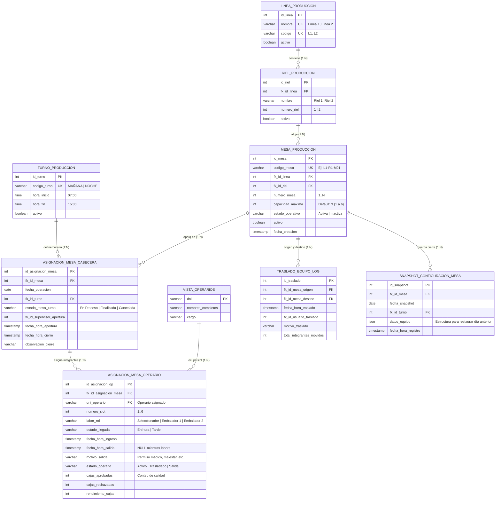

# Especificación de Base de Datos: Mesas y Asignación de Producción
**Sistema:** SAFCO Intranet Corporativa  
**Área Solicitante:** Producción / Operaciones Agroindustriales  
**Destinatarios:** Administrador de Base de Datos (DBA) / Ingenieros Backend  
**Motor de Base de Datos:** PostgreSQL 14+ (Compatible con MySQL 8.0+)  
**Estado:** Aprobado para Implementación  
**Versión:** 1.0 (Normalización 3NF · Cero Redundancia de Historial)  

---

## 1. Alcance y Arquitectura General

El módulo gestiona la infraestructura de mesas de producción y el control en tiempo real de asignación de cuadrillas operativas en líneas de empaque agrícola:
1. **Infraestructura Jerárquica:** Organización de la planta por Líneas de Producción (ej: Línea 1..4), Rieles (Riel 1, Riel 2) y Mesas físicas individuales numeradas (`L1-R1-M01`, `L1-R1-M02`).
2. **Capacidad y Estado:** Cada mesa cuenta con una capacidad configurable (por defecto 3 operarios; parametrizable de 1 a 6) y estados operativos (`Activa`, `Inactiva`). Soporta creación masiva (*bulk*) con numeración secuencial garantizada.
3. **Asignación Operativa por Puesto/Slot:** Asignación de operarios mediante escáner láser o código QR a puestos específicos en la mesa con roles definidos: `Seleccionador` (SEL) y `Embalador` (EMB 1, EMB 2).
4. **Asistencia Integrada en Mesa:** Registro de estado de llegada (`En hora`, `Tarde`) al ocupar el puesto, y captura de fecha/hora y **motivo de salida** al retirarse el operario.
5. **Operaciones Avanzadas de Cuadrilla:**
   - **Traslado de Equipo:** Reubicación íntegra de cuadrillas entre mesas, rieles o líneas.
   - **Rotación Circular por Riel:** Rotación cíclica de operarios dentro de su propio riel manteniendo la conformación del equipo.
   - **Snapshot y Restauración del Día Anterior:** Guardado del estado operativo al finalizar proceso para restaurar la cuadrilla en la siguiente jornada con 1 clic.
6. **Métricas en Tiempo Real:** Seguimiento de cajas aprobadas, cajas rechazadas y rendimiento porcentual por operario y por mesa.

### Decisiones Clave de Normalización y Arquitectura (3NF):
- **Cero Redundancia de Historial:** Se descartan tablas duplicadas de auditoría o bitácoras de asignación. La tabla transaccional `asignacion_mesa_operario` registra cuándo ingresó, cuándo salió, qué motivo tuvo y qué volumen de cajas procesó. La trazabilidad histórica completa de cualquier operario o mesa se obtiene mediante vistas SQL indexadas (*On-Demand*) con latencia menor a 2 ms.
- **Desacoplamiento de Herramientas:** Las herramientas/implementos (tijeras, pesas, calibradores) se asignan a la persona (operario por DNI), no a la mesa, garantizando que el operario conserve su instrumental ante rotaciones o traslados.
- **Regla de Negocio del Seleccionador:** Toda mesa operativa requiere exactamente un único `Seleccionador` activo. La vista analítica `v_estado_actual_mesas` computa de forma nativa si una mesa está `Operativa Completa`, `Incompleta`, `Sin Seleccionador` o `Vacía`.

---

## 2. Diagrama Entidad-Relación (UML / ERD Mermaid)



---

## 3. Matriz de Entidades y Cardinalidad

| Entidad Origen | Cardinalidad | Entidad Destino | Llave Foránea (FK) | Regla de Negocio e Integridad |
|---|:---:|---|---|---|
| `linea_produccion` | **1 : N** | `riel_produccion` | `fk_id_linea` | Cada línea agrupa sus rieles correspondientes (`ON DELETE RESTRICT`). |
| `riel_produccion` | **1 : N** | `mesa_produccion` | `fk_id_riel` | Cada riel contiene un conjunto de mesas físicas identificadas (`ON DELETE RESTRICT`). |
| `mesa_produccion` | **1 : N** | `asignacion_mesa_cabecera` | `fk_id_mesa` | Una mesa física tiene múltiples jornadas/turnos a lo largo del tiempo. |
| `turno_produccion` | **1 : N** | `asignacion_mesa_cabecera` | `fk_id_turno` | Cada asignación diaria pertenece a un turno específico (Mañana o Noche). |
| `asignacion_mesa_cabecera` | **1 : N** | `asignacion_mesa_operario` | `fk_id_asignacion_mesa` | Una cabecera de mesa agrupa a los operarios en sus slots (`ON DELETE CASCADE`). |
| `vista_operarios` | **1 : N** | `asignacion_mesa_operario` | `dni_operario` | Un operario puede ser asignado en diferentes fechas y slots. |
| `mesa_produccion` | **1 : N** | `traslado_equipo_log` | `fk_id_mesa_origen` / `destino` | Auditoría de traslados completos entre mesas físicas. |
| `mesa_produccion` | **1 : N** | `snapshot_configuracion_mesa` | `fk_id_mesa` | Respaldo del cierre de turno para la función de restauración. |

---

## 4. Diccionario de Datos Exhaustivo

### Tabla: `linea_produccion`
*Catálogo de líneas maestras de empaque.*

| Columna | Tipo de Dato | Clave | Nulo | Default | Descripción |
|---|---|:---:|:---:|---|---|
| `id_linea` | `SERIAL` | **PK** | NO | Autoincrementable | Identificador primario de la línea. |
| `nombre` | `VARCHAR(50)` | **UK** | NO | - | Nombre descriptivo (ej: 'Línea 1'). |
| `codigo` | `VARCHAR(10)` | **UK** | NO | - | Código corto (ej: 'L1'). |
| `activo` | `BOOLEAN` | - | NO | `TRUE` | Bandera de estado activo / borrado lógico. |

---

### Tabla: `riel_produccion`
*Subdivisión de transporte interno en cada línea.*

| Columna | Tipo de Dato | Clave | Nulo | Default | Descripción |
|---|---|:---:|:---:|---|---|
| `id_riel` | `SERIAL` | **PK** | NO | Autoincrementable | Identificador primario del riel. |
| `fk_id_linea` | `INT` | **FK** | NO | - | Referencia a `linea_produccion(id_linea)`. |
| `nombre` | `VARCHAR(50)` | - | NO | - | Nombre visible (ej: 'Riel 1', 'Riel 2'). |
| `numero_riel` | `INT` | - | NO | - | Número de riel dentro de la línea (1, 2). |
| `activo` | `BOOLEAN` | - | NO | `TRUE` | Estado de vigencia del riel. |

---

### Tabla: `mesa_produccion`
*Inventario de infraestructura física de mesas de trabajo.*

| Columna | Tipo de Dato | Clave | Nulo | Default | Descripción |
|---|---|:---:|:---:|---|---|
| `id_mesa` | `SERIAL` | **PK** | NO | Autoincrementable | Identificador único de la mesa física. |
| `codigo_mesa` | `VARCHAR(20)` | **UK** | NO | - | Código oficial estándar (ej: `L1-R1-M01`). |
| `fk_id_linea` | `INT` | **FK** | NO | - | Referencia foránea a la línea de pertenencia. |
| `fk_id_riel` | `INT` | **FK** | NO | - | Referencia foránea al riel donde está instalada. |
| `numero_mesa` | `INT` | - | NO | - | Número correlativo dentro del riel. |
| `capacidad_maxima` | `INT` | - | NO | `3` | Capacidad máxima de operarios (1 a 6). |
| `estado_operativo` | `VARCHAR(20)` | - | NO | `'Activa'` | Estado de disponibilidad: `'Activa'`, `'Inactiva'`. |
| `activo` | `BOOLEAN` | - | NO | `TRUE` | Borrado lógico / vigencia en catálogo. |
| `fecha_creacion` | `TIMESTAMP` | - | NO | `CURRENT_TIMESTAMP` | Fecha y hora de alta de la mesa. |

---

### Tabla: `turno_produccion`
*Definición de turnos de trabajo estándar en planta.*

| Columna | Tipo de Dato | Clave | Nulo | Default | Descripción |
|---|---|:---:|:---:|---|---|
| `id_turno` | `SERIAL` | **PK** | NO | Autoincrementable | Identificador único del turno. |
| `codigo_turno` | `VARCHAR(20)` | **UK** | NO | - | Código visible (ej: 'MAÑANA', 'NOCHE'). |
| `hora_inicio` | `TIME` | - | NO | - | Hora de inicio programada (ej: 07:00). |
| `hora_fin` | `TIME` | - | NO | - | Hora de término programada (ej: 15:30). |
| `activo` | `BOOLEAN` | - | NO | `TRUE` | Estado de vigencia del turno. |

---

### Tabla: `asignacion_mesa_cabecera`
*Sesión operativa diaria de una mesa para un turno determinado.*

| Columna | Tipo de Dato | Clave | Nulo | Default | Descripción |
|---|---|:---:|:---:|---|---|
| `id_asignacion_mesa` | `SERIAL` | **PK** | NO | Autoincrementable | Identificador primario de la sesión de mesa. |
| `fk_id_mesa` | `INT` | **FK** | NO | - | Referencia a `mesa_produccion(id_mesa)`. |
| `fecha_operacion` | `DATE` | - | NO | `CURRENT_DATE` | Fecha de ejecución del proceso. |
| `fk_id_turno` | `INT` | **FK** | NO | - | Referencia a `turno_produccion(id_turno)`. |
| `estado_mesa_turno` | `VARCHAR(20)` | - | NO | `'En Proceso'` | Estados: `'En Proceso'`, `'Finalizada'`, `'Cancelada'`. |
| `fk_id_supervisor_apertura` | `INT` | - | NO | - | ID del supervisor que habilitó la mesa. |
| `fecha_hora_apertura` | `TIMESTAMP` | - | NO | `CURRENT_TIMESTAMP` | Momento de apertura de la mesa. |
| `fecha_hora_cierre` | `TIMESTAMP` | - | SÍ | NULL | Momento de finalización del proceso. |
| `observacion_cierre` | `VARCHAR(255)` | - | SÍ | NULL | Observaciones al cerrar la mesa. |

---

### Tabla: `asignacion_mesa_operario`
*Detalle de integrantes por puesto/slot, control de asistencia y rendimiento.*

| Columna | Tipo de Dato | Clave | Nulo | Default | Descripción |
|---|---|:---:|:---:|---|---|
| `id_asignacion_op` | `SERIAL` | **PK** | NO | Autoincrementable | Identificador de asignación del operario. |
| `fk_id_asignacion_mesa` | `INT` | **FK** | NO | - | Referencia a `asignacion_mesa_cabecera`. |
| `dni_operario` | `VARCHAR(20)` | **FK** | NO | - | DNI del operario asignado al puesto. |
| `numero_slot` | `INT` | - | NO | - | Posición en la mesa (Slot 1, Slot 2, etc.). |
| `labor_rol` | `VARCHAR(30)` | - | NO | - | Labor: `'Seleccionador'`, `'Embalador 1'`, `'Embalador 2'`. |
| `estado_llegada` | `VARCHAR(20)` | - | NO | `'En hora'` | Asistencia al ingresar: `'En hora'`, `'Tarde'`. |
| `fecha_hora_ingreso` | `TIMESTAMP` | - | NO | `CURRENT_TIMESTAMP` | Momento exacto de escaneo / colocación en mesa. |
| `fecha_hora_salida` | `TIMESTAMP` | - | SÍ | NULL | Momento de salida. NULL mientras siga laborando. |
| `motivo_salida` | `VARCHAR(255)` | - | SÍ | NULL | Causa registrada: Permiso médico, malestar, etc. |
| `estado_operario` | `VARCHAR(20)` | - | NO | `'Activo'` | Estados: `'Activo'`, `'Trasladado'`, `'Salida'`. |
| `cajas_aprobadas` | `INT` | - | NO | `0` | Cajas calificadas conforme por control de calidad. |
| `cajas_rechazadas` | `INT` | - | NO | `0` | Cajas descartadas por observaciones de calidad. |
| `rendimiento_cajas` | `INT` | - | NO | `0` | Total de cajas procesadas por el operario. |

---

### Tabla: `traslado_equipo_log`
*Auditoría histórica de traslados completos de cuadrilla entre mesas.*

| Columna | Tipo de Dato | Clave | Nulo | Default | Descripción |
|---|---|:---:|:---:|---|---|
| `id_traslado` | `SERIAL` | **PK** | NO | Autoincrementable | Identificador único de auditoría de traslado. |
| `fk_id_mesa_origen` | `INT` | **FK** | NO | - | ID de la mesa física de origen. |
| `fk_id_mesa_destino` | `INT` | **FK** | NO | - | ID de la mesa física de destino. |
| `fecha_hora_traslado` | `TIMESTAMP` | - | NO | `CURRENT_TIMESTAMP` | Momento exacto de ejecución del traslado. |
| `fk_id_usuario_traslado` | `INT` | - | NO | - | ID del supervisor que ordenó el traslado. |
| `motivo_traslado` | `VARCHAR(255)` | - | SÍ | `'Reubicación'` | Motivo o justificación operativa. |
| `total_integrantes_movidos`| `INT` | - | NO | - | Cantidad de personas reubicadas. |

---

### Tabla: `snapshot_configuracion_mesa`
*Respaldo persistente de configuración para restauración de "Día Anterior".*

| Columna | Tipo de Dato | Clave | Nulo | Default | Descripción |
|---|---|:---:|:---:|---|---|
| `id_snapshot` | `SERIAL` | **PK** | NO | Autoincrementable | Identificador del snapshot. |
| `fk_id_mesa` | `INT` | **FK** | NO | - | Referencia a `mesa_produccion(id_mesa)`. |
| `fecha_snapshot` | `DATE` | - | NO | - | Fecha de la configuración guardada. |
| `fk_id_turno` | `INT` | **FK** | NO | - | Turno del snapshot guardado. |
| `datos_equipo` | `JSON` | - | NO | - | Payload JSON con DNIs, nombres y roles. |
| `fecha_hora_registro` | `TIMESTAMP` | - | NO | `CURRENT_TIMESTAMP` | Momento de captura del snapshot. |

---

## 5. Script SQL DDL Ejecutable

```sql
-- =========================================================================
-- SAFCO - DDL: INFRAESTRUCTURA, MESAS Y ASIGNACIÓN DE PRODUCCIÓN
-- =========================================================================

-- 1. TABLA: LÍNEA DE PRODUCCIÓN
CREATE TABLE linea_produccion (
    id_linea SERIAL PRIMARY KEY,
    nombre VARCHAR(50) NOT NULL UNIQUE,
    codigo VARCHAR(10) NOT NULL UNIQUE,
    activo BOOLEAN DEFAULT TRUE
);

-- 2. TABLA: RIEL DE PRODUCCIÓN
CREATE TABLE riel_produccion (
    id_riel SERIAL PRIMARY KEY,
    fk_id_linea INT NOT NULL REFERENCES linea_produccion(id_linea) ON DELETE RESTRICT,
    nombre VARCHAR(50) NOT NULL,
    numero_riel INT NOT NULL,
    activo BOOLEAN DEFAULT TRUE,
    CONSTRAINT uk_linea_riel UNIQUE (fk_id_linea, numero_riel)
);

-- 3. TABLA: MESA DE PRODUCCIÓN
CREATE TABLE mesa_produccion (
    id_mesa SERIAL PRIMARY KEY,
    codigo_mesa VARCHAR(20) NOT NULL UNIQUE,
    fk_id_linea INT NOT NULL REFERENCES linea_produccion(id_linea) ON DELETE RESTRICT,
    fk_id_riel INT NOT NULL REFERENCES riel_produccion(id_riel) ON DELETE RESTRICT,
    numero_mesa INT NOT NULL,
    capacidad_maxima INT NOT NULL DEFAULT 3,
    estado_operativo VARCHAR(20) NOT NULL DEFAULT 'Activa',
    activo BOOLEAN DEFAULT TRUE,
    fecha_creacion TIMESTAMP DEFAULT CURRENT_TIMESTAMP,
    CONSTRAINT uk_riel_numero_mesa UNIQUE (fk_id_riel, numero_mesa)
);

-- 4. TABLA: TURNO DE PRODUCCIÓN
CREATE TABLE turno_produccion (
    id_turno SERIAL PRIMARY KEY,
    codigo_turno VARCHAR(20) NOT NULL UNIQUE,
    hora_inicio TIME NOT NULL,
    hora_fin TIME NOT NULL,
    activo BOOLEAN DEFAULT TRUE
);

-- 5. TABLA: ASIGNACIÓN CABECERA DE MESA
CREATE TABLE asignacion_mesa_cabecera (
    id_asignacion_mesa SERIAL PRIMARY KEY,
    fk_id_mesa INT NOT NULL REFERENCES mesa_produccion(id_mesa) ON DELETE RESTRICT,
    fecha_operacion DATE NOT NULL DEFAULT CURRENT_DATE,
    fk_id_turno INT NOT NULL REFERENCES turno_produccion(id_turno) ON DELETE RESTRICT,
    estado_mesa_turno VARCHAR(20) NOT NULL DEFAULT 'En Proceso',
    fk_id_supervisor_apertura INT NOT NULL,
    fecha_hora_apertura TIMESTAMP NOT NULL DEFAULT CURRENT_TIMESTAMP,
    fecha_hora_cierre TIMESTAMP NULL,
    observacion_cierre VARCHAR(255) NULL
);

-- 6. TABLA: ASIGNACIÓN DETALLE DE OPERARIO
CREATE TABLE asignacion_mesa_operario (
    id_asignacion_op SERIAL PRIMARY KEY,
    fk_id_asignacion_mesa INT NOT NULL REFERENCES asignacion_mesa_cabecera(id_asignacion_mesa) ON DELETE CASCADE,
    dni_operario VARCHAR(20) NOT NULL,
    numero_slot INT NOT NULL,
    labor_rol VARCHAR(30) NOT NULL,
    estado_llegada VARCHAR(20) DEFAULT 'En hora',
    fecha_hora_ingreso TIMESTAMP NOT NULL DEFAULT CURRENT_TIMESTAMP,
    fecha_hora_salida TIMESTAMP NULL,
    motivo_salida VARCHAR(255) NULL,
    estado_operario VARCHAR(20) DEFAULT 'Activo',
    cajas_aprobadas INT DEFAULT 0,
    cajas_rechazadas INT DEFAULT 0,
    rendimiento_cajas INT DEFAULT 0
);

-- 7. TABLA: TRASLADO DE EQUIPO LOG
CREATE TABLE traslado_equipo_log (
    id_traslado SERIAL PRIMARY KEY,
    fk_id_mesa_origen INT NOT NULL REFERENCES mesa_produccion(id_mesa),
    fk_id_mesa_destino INT NOT NULL REFERENCES mesa_produccion(id_mesa),
    fecha_hora_traslado TIMESTAMP NOT NULL DEFAULT CURRENT_TIMESTAMP,
    fk_id_usuario_traslado INT NOT NULL,
    motivo_traslado VARCHAR(255) DEFAULT 'Reubicación operativa de cuadrilla',
    total_integrantes_movidos INT NOT NULL
);

-- 8. TABLA: SNAPSHOT DE CONFIGURACIÓN DE MESAS
CREATE TABLE snapshot_configuracion_mesa (
    id_snapshot SERIAL PRIMARY KEY,
    fk_id_mesa INT NOT NULL REFERENCES mesa_produccion(id_mesa) ON DELETE CASCADE,
    fecha_snapshot DATE NOT NULL,
    fk_id_turno INT NOT NULL REFERENCES turno_produccion(id_turno),
    datos_equipo JSON NOT NULL,
    fecha_hora_registro TIMESTAMP DEFAULT CURRENT_TIMESTAMP,
    CONSTRAINT uk_snapshot_mesa_fecha UNIQUE (fk_id_mesa, fecha_snapshot, fk_id_turno)
);

-- =========================================================================
-- ÍNDICES DE ALTO RENDIMIENTO
-- =========================================================================
CREATE INDEX idx_mesa_linea_riel ON mesa_produccion(fk_id_linea, fk_id_riel, codigo_mesa);
CREATE INDEX idx_asig_cabecera_fecha ON asignacion_mesa_cabecera(fecha_operacion, fk_id_mesa);
CREATE INDEX idx_asig_operario_dni ON asignacion_mesa_operario(dni_operario, fecha_hora_ingreso DESC);
CREATE INDEX idx_asig_operario_salida ON asignacion_mesa_operario(fk_id_asignacion_mesa, fecha_hora_salida);

-- =========================================================================
-- VISTAS ANALÍTICAS ON-DEMAND (Cero Redundancia de Historial)
-- =========================================================================

-- Vista 1: Estado Operativo y KPIs en Vivo por Mesa
CREATE OR REPLACE VIEW v_estado_actual_mesas AS
SELECT 
    m.id_mesa,
    m.codigo_mesa,
    l.nombre AS linea,
    r.nombre AS riel,
    m.capacidad_maxima,
    c.id_asignacion_mesa,
    c.fecha_operacion,
    COUNT(o.id_asignacion_op) FILTER (WHERE o.fecha_hora_salida IS NULL) AS total_operarios_activos,
    COUNT(o.id_asignacion_op) FILTER (WHERE o.labor_rol = 'Seleccionador' AND o.fecha_hora_salida IS NULL) AS cuenta_seleccionadores,
    CASE 
        WHEN COUNT(o.id_asignacion_op) FILTER (WHERE o.fecha_hora_salida IS NULL) = 0 THEN 'Vacía'
        WHEN COUNT(o.id_asignacion_op) FILTER (WHERE o.labor_rol = 'Seleccionador' AND o.fecha_hora_salida IS NULL) = 0 THEN 'Sin Seleccionador'
        WHEN COUNT(o.id_asignacion_op) FILTER (WHERE o.fecha_hora_salida IS NULL) >= m.capacidad_maxima THEN 'Operativa Completa'
        ELSE 'Incompleta'
    END AS estado_alerta_kpi
FROM mesa_produccion m
INNER JOIN linea_produccion l ON m.fk_id_linea = l.id_linea
INNER JOIN riel_produccion r ON m.fk_id_riel = r.id_riel
LEFT JOIN asignacion_mesa_cabecera c ON m.id_mesa = c.fk_id_mesa AND c.fecha_operacion = CURRENT_DATE AND c.estado_mesa_turno = 'En Proceso'
LEFT JOIN asignacion_mesa_operario o ON c.id_asignacion_mesa = o.fk_id_asignacion_mesa
WHERE m.estado_operativo = 'Activa' AND m.activo = TRUE
GROUP BY m.id_mesa, m.codigo_mesa, l.nombre, r.nombre, m.capacidad_maxima, c.id_asignacion_mesa, c.fecha_operacion;

-- Vista 2: Historial de Operarios y Asistencia en Mesas
CREATE OR REPLACE VIEW v_historial_operario_mesas AS
SELECT 
    o.dni_operario,
    m.codigo_mesa,
    l.nombre AS linea,
    r.nombre AS riel,
    c.fecha_operacion,
    o.numero_slot,
    o.labor_rol,
    o.estado_llegada,
    o.fecha_hora_ingreso,
    o.fecha_hora_salida,
    COALESCE(o.motivo_salida, 'En Mesa Actualmente') AS motivo_salida,
    o.cajas_aprobadas,
    o.cajas_rechazadas,
    o.rendimiento_cajas
FROM asignacion_mesa_operario o
INNER JOIN asignacion_mesa_cabecera c ON o.fk_id_asignacion_mesa = c.id_asignacion_mesa
INNER JOIN mesa_produccion m ON c.fk_id_mesa = m.id_mesa
INNER JOIN linea_produccion l ON m.fk_id_linea = l.id_linea
INNER JOIN riel_produccion r ON m.fk_id_riel = r.id_riel;

-- Vista 3: Métricas de Rendimiento y Calidad de Cajas por Mesa
CREATE OR REPLACE VIEW v_resumen_rendimiento_mesas AS
SELECT 
    m.codigo_mesa,
    l.nombre AS linea,
    r.nombre AS riel,
    c.fecha_operacion,
    SUM(o.cajas_aprobadas) AS total_aprobadas,
    SUM(o.cajas_rechazadas) AS total_rechazadas,
    (SUM(o.cajas_aprobadas) + SUM(o.cajas_rechazadas)) AS total_cajas,
    CASE 
        WHEN (SUM(o.cajas_aprobadas) + SUM(o.cajas_rechazadas)) > 0 
        THEN ROUND((SUM(o.cajas_aprobadas)::NUMERIC / (SUM(o.cajas_aprobadas) + SUM(o.cajas_rechazadas))) * 100, 1)
        ELSE 0
    END AS porcentaje_calidad_ok
FROM asignacion_mesa_operario o
INNER JOIN asignacion_mesa_cabecera c ON o.fk_id_asignacion_mesa = c.id_asignacion_mesa
INNER JOIN mesa_produccion m ON c.fk_id_mesa = m.id_mesa
INNER JOIN linea_produccion l ON m.fk_id_linea = l.id_linea
INNER JOIN riel_produccion r ON m.fk_id_riel = r.id_riel
GROUP BY m.codigo_mesa, l.nombre, r.nombre, c.fecha_operacion;
```

---

## 6. Consultas Típicas del Backend (Endpoints REST)

```sql
-- 1. Endpoint: GET /api/produccion/mesas/en-vivo?linea=Línea 1&riel=Riel 1
-- Retorna el estado en vivo de todas las mesas para la cuadrícula interactiva
SELECT * 
FROM v_estado_actual_mesas 
WHERE linea = 'Línea 1' 
ORDER BY codigo_mesa ASC;

-- 2. Endpoint: GET /api/produccion/operarios/:dni/historial-mesas
-- Retorna la trazabilidad cronológica de un operario por mesas y motivos de salida
SELECT * 
FROM v_historial_operario_mesas 
WHERE dni_operario = '45892011' 
ORDER BY fecha_hora_ingreso DESC;

-- 3. Endpoint: GET /api/produccion/mesas/:codigo/rendimiento
-- Retorna el acumulado de cajas aprobadas vs rechazadas de una mesa
SELECT * 
FROM v_resumen_rendimiento_mesas 
WHERE codigo_mesa = 'L1-R1-M03' AND fecha_operacion = CURRENT_DATE;

-- 4. Endpoint: POST /api/produccion/mesas/rotar-riel
-- Consulta para rotación circular: selecciona las mesas ocupadas en orden dentro de un riel
SELECT m.codigo_mesa, array_agg(o.dni_operario ORDER BY o.numero_slot) AS operarios_actuales
FROM mesa_produccion m
INNER JOIN asignacion_mesa_cabecera c ON m.id_mesa = c.fk_id_mesa AND c.fecha_operacion = CURRENT_DATE AND c.estado_mesa_turno = 'En Proceso'
INNER JOIN asignacion_mesa_operario o ON c.id_asignacion_mesa = o.fk_id_asignacion_mesa AND o.fecha_hora_salida IS NULL
WHERE m.fk_id_linea = 1 AND m.fk_id_riel = 1
GROUP BY m.codigo_mesa
HAVING COUNT(o.id_asignacion_op) > 0
ORDER BY m.codigo_mesa ASC;
```
